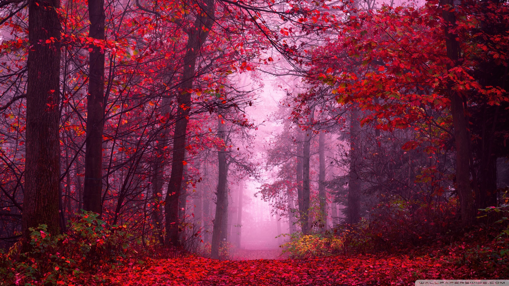

# Image-Palette-Extractor


A modular command-line tool that extracts dominant color palettes from images using K-means clustering. Perfect for designers, developers, or anyone who needs to pull colors from images quickly.

## What it does

This tool analyzes any image (local file or URL) and extracts its most dominant colors using K-means clustering with the option to filter out extremely dark/bright colors. The colors can be sorted by hue (rainbow order), saturation, or brightness, making it easy to create harmonious color schemes that suit your needs. You can export colors in multiple formats: RGB, Hex, or RGBA with custom opacity.

## Demo

### Original Image


### Extracted Palette


*Extracting 7 dominant colors from the test image above*

## Project Structure

The codebase uses an object-oriented architecture with focused, reusable modules:

```
Image-Palette-Extractor/
├── image_palette_extractor/  # Main package directory
│   ├── __init__.py
│   ├── main.py            # Entry point - orchestrates the application flow
│   ├── image_palette.py   # ImagePalette class - core palette extraction and manipulation
│   ├── cli.py             # Command-line interface and user interaction
│   ├── image_utils.py     # Image processing utilities (filtering, display)
│   └── color_utils.py     # Color conversion functions (RGB to Hue/Saturation/Brightness/Hex)
├── pyproject.toml         # Package configuration for pip installation
├── requirements.txt       # Python dependencies
└── Test_Images/           # Sample images for testing
```

The `ImagePalette` class encapsulates all color palette operations, making the code easy to maintain, test, and extend with new features.

## Features

- 🎨 **Extract 1-20 dominant colors** from any image using K-means clustering
- 🖱️ **Interactive menu navigation** - arrow keys and visual selection with questionary
- 📁 **Smart file selection** - autocomplete for local files or paste URLs
- 🌈 **Flexible color sorting** - sort by hue (rainbow order), saturation, or brightness
- 🎯 **Smart color filtering** - exclude very dark or very light colors with custom brightness thresholds
- 🔄 **Complementary color conversion** - instantly convert your palette to complementary colors
- 📋 **Multiple export formats**:
  - RGB values: `(224, 153, 195), (158, 79, 116), ...`
  - Hex codes: `#E099C3, #9E4F74, ...`
  - RGBA JSON: `["rgba(224, 153, 195, 0.15)", ...]`
- 📎 **Copy to clipboard** with one click (RGB or Hex)
- 🔄 **Reverse color order** if you need the palette backwards
- 🖼️ **Image preview in terminal** (if climage is installed)
- 🌐 **Supports URLs and local files** (http, https, ftp protocols)
- ⚡ **Fast processing** - images are automatically resized for speed
- ⌨️ **Graceful interrupts** - Ctrl+C exits cleanly at any point

## Installation

### Option 1: Install with pip (Recommended)

Install directly from GitHub:
```bash
pip install git+https://github.com/josh-weston-g/Image-Palette-Extractor.git
```

Then run from anywhere:
```bash
palette-extract
```

### Option 2: Manual Installation

1. **Clone the repository:**
   ```bash
   git clone https://github.com/josh-weston-g/Image-Palette-Extractor.git
   cd Image-Palette-Extractor
   ```

2. **Create a virtual environment (recommended):**
   ```bash
   python -m venv venv
   source venv/bin/activate  # On Windows: venv\Scripts\activate
   ```

3. **Install dependencies:**
   ```bash
   pip install -r requirements.txt
   ```

4. **Run the program:**
   ```bash
   python image_palette_extractor/main.py
   ```

## Usage

If installed with pip:
```bash
palette-extract
```

If running manually:
```bash
python image_palette_extractor/main.py
```
```bash
python main.py
```

**Tip:** The repository includes sample images in the `Test_Images/` directory that you can use to test the tool.

The tool provides an interactive menu-driven workflow:

1. **Load an image** - Choose between local file (with autocomplete) or URL
2. **Set color count** - Extract 1-20 dominant colors
3. **View your palette** - See colors with RGB values, Hex codes, and color swatches (sorted by hue by default)
4. **Interactive options menu** with arrow key navigation:
   - **Reverse** the color order
   - **Sort** by hue, saturation, or brightness
   - **Convert** to complementary colors (opposite on the color wheel)
   - **Copy** RGB or Hex values to clipboard
   - **Export** to RGBA JSON format (with custom opacity)
   - **Toggle HSV** values display on and off
   - **Re-extract** with different color counts
   - **Filter** dark/bright colors with customizable brightness thresholds
### Loading from URL
```bash
python main.py
```
1. Select **"Image URL"** from the menu
2. Paste your URL: `https://example.com/wallpaper.jpg`

### Loading local file
```bash
python main.py
```
1. Select **"Local file path"** from the menu
2. Use autocomplete to navigate to your image

### Output formats

**RGB format:**
```
(224, 153, 195), (158, 79, 116), (96, 33, 55), (53, 12, 25), (151, 27, 48)
```

**Hex format:**
```
#E099C3, #9E4F74, #602137, #350C19, #971B30
```

**RGBA JSON format:**
```json
[
  "rgba(224, 153, 195, 0.15)",
  "rgba(158, 79, 116, 0.15)",
  "rgba(96, 33, 55, 0.15)",
  "rgba(53, 12, 25, 0.15)",
  "rgba(151, 27, 48, 0.15)"
]
```

## Requirements

- Python 3.8+
- PIL (Pillow)
- NumPy
- scikit-learn
- requests
- questionary
- pyperclip (optional - for clipboard functionality)
- climage (optional - for terminal image preview)

## Troubleshooting

### Default brightness thresholds
When filtering dark/bright colors, the tool uses these defaults:
- **Dark filter threshold:** 0.15 (filters colors darker than 15% brightness)
- **Bright filter threshold:** 0.85 (filters colors brighter than 85% brightness)

You can customize these values when prompted during filtering.

### Clipboard not working
If you get an error when trying to copy colors to clipboard:
- **Linux:** Install `xclip` or `xsel`
  ```bash
  sudo apt-get install xclip
  ```
- **macOS:** Clipboard should work by default
- **Windows:** Clipboard should work by default

### Image preview not showing
The terminal image preview is optional and requires the `climage` package:
```bash
pip install climage
```
If you don't have it installed, the tool will still work - you just won't see the image preview.

### "Failed to load image" error
- Check that the file path is correct and the file exists
- For URLs, make sure you have an active internet connection
- Ensure the file is a valid image format (JPG, PNG, etc.)

### Module not found errors
Make sure you've activated your virtual environment and installed all dependencies:
```bash
source venv/bin/activate  # On Windows: venv\Scripts\activate
pip install -r requirements.txt
```

## Contributing

Contributions are welcome! If you'd like to contribute:

1. Fork the repository
2. Create a new branch for your feature
3. Make your changes
4. Submit a Pull Request

Please ensure your code follows the existing style and test it with the sample images before submitting.

## License

This project is licensed under the MIT License - see the [LICENSE](LICENSE) file for details.

## Author

Josh Weston - [@josh-weston-g](https://github.com/josh-weston-g)
